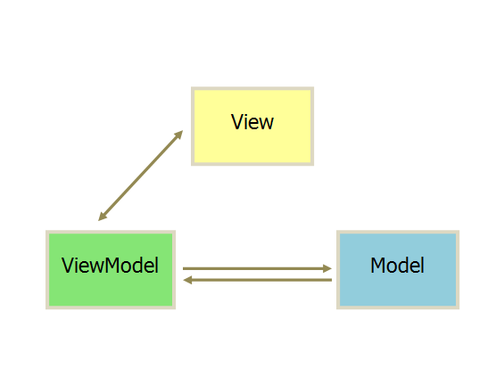

# ByteDance_DevNote

2021.08.27-Unknown

Beijing,China

xujunjielong@bytedance.com

## Knowledge

### 1.iOS


### 2. Architechure

注意：以下架构有争议，主要争议点大多和不同系统/不同时间的实现之间的区别。具体可以参考：https://draveness.me/mvx/

#### MVC

- 通信都是单向的

- 用户操作View，View传送指令到Controller
- Controller**完成业务逻辑**并要求Model更改状态
- Model将新状态的数据发送到View对用户反馈


#### MVP

- 通信都是双向的
- View与Model完全解耦
- View是被动视图，不具备主动性；Model仅保存数据和对象状态
- Presenter包含一切业务逻辑


#### MVVM

- 与MVP的唯一区别在于：View和ViewModel是双向绑定的。一切View/ViewModel的变动都会直接反馈在ViewModel/View上



### 3. Objective-C

#### 消息传递

Objective-C里，与其说对象**互相调用方法**，不如说对象之间**互相传递消息**更为精确。此二种风格的主要差异在于调用方法/消息传递这个动作。C++里类别与方法的关系严格清楚，一个方法必定属于一个类别，而且在**编译**时（compile time）就已经紧密绑定，不可能调用一个不存在类别里的方法。但在Objective-C，类别与消息的关系比较松散，调用方法视为对对象发送消息，所有方法都被视为对消息的回应。所有消息处理直到**运行**时（runtime）才会动态决定，并交由类别自行决定如何处理收到的消息。

换句话说，oc里面的方法调用，只是**建议**而非**强制**

C++里，送一个消息给对象（或者说调用一个方法）的语法如下：

```cpp
obj.method(argument);
```

Objective-C则写成：

```objective-c
[obj method: argument];
```

#### 数字

因为OC是C语言一系的, 所以那些复杂的数据类型在OC里都是支持的, 如short, unsigned long ... 这些类型在java中没有, 所以多提一句.

另外, 数字的字面值, java中直接使用数字就行, 如`int i = 20`; 但在OC中得加一个@, 表示是OC中的值(而不是C中的值), 所以OC中的数字20就是表示为 `@20`.

#### 字符串

作为C语言的超集，Objective-C 支持 C 语言字符串方面的约定。也就是说，单个字符被单引号包括，字符串被双引号包括。然而，大多数Objective-C**通常不使用C语言风格的字符串**。反之，大多数框架把字符串传递给**NSString**对象。NSString类提供了字符串的类包装，包含了所有你期望的优点，包括对保存任意长度字符串的内建内存管理机制，支持Unicode，printf风格的格式化工具，等等。因为这种字符串使用的非常频繁，Objective-C提供了一个**助记符**可以方便地从常量值创建NSString对象。要使用这个助记符，你需要做的全部事情，是在普通的双引号字符串前放置一个**@**符号，如下面的例子所示：

```objective-c
NSString* myString = @"My String\n"; //使用助记符号@进行NSString转换
NSString* anotherString = [NSString stringWithFormat:@"%d %s", 1, @"String"];

// 从一个C语言字符串创建Objective-C字符串
NSString*  fromCString = [NSString stringWithCString:"A C string" 
encoding:NSASCIIStringEncoding];
```

#### Interface

定义部分，清楚定义了类的名称、数据成员和方法。 以关键字@interface作为开始，@end作为结束。

```objective-c
@interface MyObject : NSObject {
    int memberVar1; // 实体变量，对应cpp的protected
    id  memberVar2;
}

+(return_type) class_method; // 类方法

-(return_type) instance_method1; // 实例方法
-(return_type) instance_method2: (int) p1;
-(return_type) instance_method3: (int) p1 andPar: (int) p2;
@end
```

方法前面的 +/- 号代表函数的类型：加号（+）代表类方法（class method），不需要实例就可以调用，与C++ 的静态函数（static member function）相似。减号（-）即是一般的实例方法（instance method）。

这里提供了一份意义相近的C++语法对照，如下：

```cpp
class MyObject : public NSObject {
protected:
    int memberVar1;  // 实体变量，protected
    void * memberVar2;

  public:
    static return_type class_method(); // 类方法

    return_type instance_method1();    // 实例方法
    return_type instance_method2( int p1 );
    return_type instance_method3( int p1, int p2 );
}
```

#### Implementation

实现区块则包含了公开方法的实现，以及定义私有（private）变量及方法。 以关键字@implementation作为区块起头，@end结尾。

```objective-c
@implementation MyObject {
  int memberVar3; //实体变量，对应为Cpp里面的private
}

+(return_type) class_method {
    .... //method implementation
}
-(return_type) instance_method1 {
     ....
}
-(return_type) instance_method2: (int) p1 {
    ....
}
-(return_type) instance_method3: (int) p1 andPar: (int) p2 {
    ....
}
@end
```

值得一提的是不只Interface区块可定义实体变量，Implementation区块也可以定义实体变量，两者的差别在于访问权限的不同，I**nterface区块内的实体变量默认权限为protected，宣告于implementation区块的实体变量则默认为private**，故在Implementation区块定义私有成员更匹配面向对象之封装原则，因为如此类别之私有信息就不需曝露于公开interface（.h文件）中。

#### 创建对象

```objective-c
MyObject * my = [MyObject new];
```

#### 属性

属性是用来**代替声明存取方法**的便捷方式。属性不会在你的类声明中创建一个新的实例变量。他们仅仅是定义方法访问已有的实例变量的速记方式而已。暴露实例变量的类，**可以使用属性记号代替getter和setter语法**。类还可以使用属性暴露一些“虚拟”的实例变量，他们是部分数据动态计算的结果，而不是确实保存在实例变量内的。

实际上可以说，属性节约了你必须要写的大量多余的代码。因为大多数存取方法都是用类似的方式实现的，属性避免了为类暴露的每个实例变量提供不同的getter和setter的需求。取而代之的是，你用属性声明指定你希望的行为，然后在编译期间合成基于声明的实际的getter和setter方法。

属性声明应该放在类**接口的方法声明（Interface）**那里。基本的定义使用**@property**编译选项，紧跟着类型信息和属性的名字。你还可以用定制选项对属性进行配置，这决定了存取方法的行为。

```objective-c
@interface Person : NSObject {
    @public//显式声明public
        NSString *name;
    @private//显式声明private
        int age;
}

@property(copy) NSString *name;//拷贝的属性
@property(readonly) int age;//只读的属性

-(id)initWithAge:(int)age;
@end
```

在**类的实现（Implementation）**部分，属性的访问方法由**@synthesize**关键字来实现，它由属性的声明自动的产生一对访问方法。另外，也可以选择使用**@dynamic**关键字表明访问方法会由程序员手工提供。

```objective-c
@implementation Person
@synthesize name;//自动生成getter和setter方法
@dynamic age;//手动定义访问方法

-(id)initWithAge:(int)initAge//初始化age的构造函数：给age成员变量赋值而非给age属性赋值，属性也没有值）
{
    age = initAge; 
    return self;
}

-(int)age// 实现age的访问方法：直接返回29（这样并没有真正返回age的值。不论age是多少，访问都会得到29）
{
    return 29; 
}
@end
```

属性可以利用传统的消息表达式、**点表达式/或"valueForKey:"/"setValue:forKey:"**方法对来访问。

```objective-c
Person *aPerson = [[Person alloc] initWithAge: 53];
aPerson.name = @"Steve"; // 注意：点表达式，等于[aPerson setName: @"Steve"];
NSLog(@"Access by message (%@), dot notation(%@), property name(%@) and direct instance variable access (%@)",
      [aPerson name], aPerson.name, [aPerson valueForKey:@"name"], aPerson->name);//%占位符
```

为了利用点表达式来访问**实例**的属性，需要使用"self"关键字：

```objective-c
-(void) introduceMyselfWithProperties:(BOOL)useGetter
{
    NSLog(@"Hi, my name is %@.", (useGetter ? self.name : name)); // NOTE: getter vs. ivar access
}
```

类或协议的属性可以被**动态的读取**（使用指针，通过property_getName方法（自动生成的方法getter）获得）。

```objective-c
int i;
int propertyCount = 0;
objc_property_t *propertyList = class_copyPropertyList([aPerson class], &propertyCount);

for ( i=0; i < propertyCount; i++ ) {
    objc_property_t *thisProperty = propertyList + i;
    const char* propertyName = property_getName(*thisProperty);
    NSLog(@"Person has a property: '%s'", propertyName);
}
```

#### Protocol

协议是一组**没有实现的方法列表**，任何的类均可采纳协议并具体实现这组方法。（就是Java和C#的**Interface**，

或者C++的纯虚类）

有两种定义协议的方式：由编译器保证的"正式协议"，以及为特定目的设定的"非正式协议"。

**非正式协议**为一个可以选择性实现的一系列方法列表。非正式协议虽名为协议，但实际上是挂于NSObject上的**未实现分类**（Unimplemented Category）的一种称谓，Objetive-C语言机制上并没有非正式协议这种东西，OSX 10.6版本之后由于引入**@optional**关键字，使得正式协议已具备同样的能力，所以非正式协议已经被废弃不再使用。

**正式协议**类似于Java中的"**接口**"，它是一系列方法的列表，任何类都可以声明自身实现了某个协议。在Objective-C 2.0之前，一个类必须实现它声明匹配的协议中的所有方法，否则编译器会报告错误，表明这个类没有实现它声明匹配的协议中的全部方法。Objective-C 2.0版本允许标记协议中某些方法为可选的（Optional），这样编译器就不会强制实现这些可选的方法。

协议经常应用于Cocoa中的委托及事件触发。例如文本框类通常会包括一个委托（delegate）对象，该对象可以实现一个协议，该协议中可能包含一个实现文字输入的自动完成方法。若这个委托对象实现了这个方法，那么文本框类就会在适当的时候触发自动完成事件，并调用这个方法用于自动完成功能。

Objective-C中协议的概念与Java中接口的概念并不完全相同，即一个类可以在不声明它匹配某个协议的情况下，实现这个协议所包含的方法，也即实质上匹配这个协议，而这种差别对外部代码而言是不可见的。正式协议的声明不提供实现，它只是简单地表明匹配该协议的类实现了该协议的方法，保证调用端可以安全调用方法。

协议以关键字**@protocol**作为区块起始，@end结束，中间为方法列表。

```objective-c
@protocol Locking
- (void)lock;
- (void)unlock;
@end
```

这是一个协议的例子，多线程编程中经常要确保一份共享资源同时只有一个线程可以使用，会在使用前给该资源挂上锁 ，以上即为一个表明有"锁"的概念的协议，协议中有两个方法，只有名称但尚未实现。

下面的SomeClass宣称他采纳了Locking协议：

```objective-c
@interface SomeClass : SomeSuperClass <Locking>
@end
```

一旦SomeClass表明他采纳了Locking协议，SomeClass就有义务实现Locking协议中的两个方法。

```objective-c
@implementation SomeClass
- (void)lock {
  // 实现方法...
}
- (void)unlock {
  // 实现方法...
}
@end
```

由于SomeClass已经确实遵从了Locking协议，故调用端可以安全的发送lock或unlock消息给SomeClass实体变量，不需担心他没有办法回应消息。

#### Category

在Objective-C的设计中，一个主要的考虑即为大型代码框架的维护。结构化编程的经验显示，改进代码的一种主要方法即为将其分解为更小的片段。Objective-C借用并扩展了Smalltalk实现中的"分类"概念，用以帮助达到分解代码的目的。

一个分类可以将方法的实现分解进一系列分离的文件。程序员可以将一组相关的方法放进一个分类，使程序更具可读性。举例来讲，可以在字符串类中增加一个名为"拼写检查"的分类，并将拼写检查的相关代码放进这个分类中。

进一步的，分类中的方法是在运行时被加入类中的，这一特性允许程序员向现存的类中增加方法，而无需持有原有的代码，或是重新编译原有的类。例如若系统提供的字符串类的实现中不包含拼写检查的功能，可以增加这样的功能而无需更改原有的字符串类的代码。

在运行时，分类中的方法与类原有的方法并无区别，其代码可以访问包括私有类成员变量在内的所有成员变量。

若分类声明了与类中原有方法同名的函数，则分类中的方法会被调用。因此分类不仅可以增加类的方法，也可以代替原有的方法。这个特性可以用于修正原有代码中的错误，更可以从根本上改变程序中原有类的行为。若两个分类中的方法同名，则被调用的方法是不可预测的。

其它语言也尝试了通过不同方法增加这一语言特性。TOM在这方面走的更远，不仅允许增加方法，更允许增加成员变量。也有其它语言使用面向声明的解决方案，其中最值得注意的是Self语言。

C#与Visual Basic.NET语言以扩展函数的与不完全类的方式实现了类似的功能。Ruby与一些动态语言则以"monkey patch"的名字称呼这种技术。

以下例子创建了Integer类，其本身只定义了integer属性，然后增加了两个分类Arithmetic与Display以扩展类的功能。虽然分类可以访问类的私有成员，但通常利用属性的访问方法来访问是一种更好的做法，可以使得分类与原有类更加独立。这是分类的一种典型应用—另外的应用是利用分类来替换原有类中的方法，虽然用分类而不是继承来替换方法不被认为是一种好的做法。

**Integer.h 文件代码：**

```objective-c
#import <objc/Object.h>

@interface Integer : Object
{
@private
    int integer;
}

@property (assign, nonatomic) integer;

@end
```

**Integer.m 文件代码：**

```objective-c
#import "Integer.h"

@implementation Integer

@synthesize integer;

@end
```

**Arithmetic.h 文件代码：**

```objective-c
#import "Integer.h"

@interface Integer(Arithmetic)
- (id) add: (Integer *) addend;
- (id) sub: (Integer *) subtrahend;
@end
```

**Arithmetic.m 文件代码：**

```objective-c
#import "Arithmetic.h"

@implementation Integer(Arithmetic)
- (id) add: (Integer *) addend
{
    self.integer = self.integer + addend.integer;
    return self;
}

- (id) sub: (Integer *) subtrahend
{
    self.integer = self.integer - subtrahend.integer;
    return self;
}
@end
```

**Display.h 文件代码：**

```objective-c
#import "Integer.h"

@interface Integer(Display)
- (id) showstars;
- (id) showint;
@end
```

**Display.m 文件代码：**

```objective-c
#import "Display.h"

@implementation Integer(Display)
- (id) showstars
{
    int i, x = self.integer;
    for(i=0; i < x; i++)
       printf("*");
    printf("\n");

    return self;
}

- (id) showint
{
    printf("%d\n", self.integer);

    return self;
}
@end
```

**main.m 文件代码：**

```objective-c
#import "Integer.h"
#import "Arithmetic.h"
#import "Display.h"

int
main(void)
{
    Integer *num1 = [Integer new], *num2 = [Integer new];
    int x;

    printf("Enter an integer: ");
    scanf("%d", &x);

    num1.integer = x;
    [num1 showstars];

    printf("Enter an integer: ");
    scanf("%d", &x);

    num2.integer = x;
    [num2 showstars];

    [num1 add:num2];
    [num1 showint];

    return 0;
}
```

利用以下命令来编译：

```objective-c
gcc -x objective-c main.m Integer.m Arithmetic.m Display.m -lobjc
```

在编译时间，可以利用省略#import "Arithmetic.h" 与[num1 add:num2]命令，以及Arithmetic.m文件来实验。程序仍然可以运行，这表明了允许动态的、按需的加载分类；若不需要某一分类提供的功能，可以简单的不编译之。

#### 枚举

比起利用NSEnumerator对象或在集合中依次枚举，Objective-C 2.0提供了快速枚举的语法。在Objective-C 2.0中，以下循环的功能是相等的，但性能特性不同。

```objective-c
// 使用NSEnumerator
NSEnumerator *enumerator = [thePeople objectEnumerator];
Person *p;

while ( (p = [enumerator nextObject]) != nil ) {//enumerator：迭代器
    NSLog(@"%@ is %i years old.", [p name], [p age]);
}
// 使用依次枚举
for ( int i = 0; i < [thePeople count]; i++ ) {
    Person *p = [thePeople objectAtIndex:i];
    NSLog(@"%@ is %i years old.", [p name], [p age]);
}
// 使用快速枚举
for (Person *p in thePeople) {//in：自动遍历
    NSLog(@"%@ is %i years old.", [p name], [p age]);
}
```

快速枚举可以比标准枚举产生更有效的代码，由于枚举所调用的方法被使用NSFastEnumeration协议提供的指针算术运算所代替了

#### 转发

Objective-C允许对一个对象发送消息，不管它是否能够响应之。除了响应或丢弃消息以外，对象也可以将消息转发到可以响应该消息的对象。转发可以用于简化特定的设计模式，例如观测器模式或代理模式。

Objective-C运行时在Object中定义了一对方法：

转发：

```objective-c
- (retval_t) forward:(SEL) sel :(arglist_t) args; // with GCC
- (id) forward:(SEL) sel :(marg_list) args; // with NeXT/Apple systems
```

响应：

```objective-c
- (retval_t) performv:(SEL) sel :(arglist_t) args;  // with GCC
- (id) performv:(SEL) sel :(marg_list) args; // with NeXT/Apple systems
```

希望实现转发的对象只需用新的方法覆盖以上方法来定义其转发行为。无需重写响应方法performv::，由于该方法只是单纯的对响应对象发送消息并传递参数。其中，SEL类型是Objective-C中消息的类型。

#### 动态类型

对比于C++这种静态类型的语言，编译器会挡下对**（void\*）**指针调用方法的行为。但在Objective-C中，你可以对**id**发送任何消息（id很像void\*，但是被严格限制只能使用在对象上），编译器仅会发出"该对象可能无法回应消息"的警告，程序可以通过编译，而实际发生的事则取决于运行期该对象的真正形态，若该对象的确可以回应消息，则依旧运行对应的方法。

一个对象收到消息之后，他有三种处理消息的可能手段，第一是回应该消息并运行方法**，若无法回应，则可以转发消息给其他对象**，若以上两者均无，就要处理无法回应而抛出的例外。**只要进行三者之其一，该消息就算完成任务而被丢弃**。若对"nil"（空对象指针）发送消息，该消息通常会被忽略，取决于编译器选项可能会抛出例外。

虽然Objective-C具备动态类型的能力，但编译期的静态类型检查依旧可以应用到变量上。以下三种声明在运行时效力是完全相同的，但是三种声明提供了一个比一个更明显的类型信息，附加的类型信息让编译器在编译时可以检查变量类型，并对类型不符的变量提出警告。

下面三个方法，差异仅在于参数的形态：

```objective-c
- setMyValue:(id) foo;
```

id形态表示参数"foo"可以是任何类的实例。

```objective-c
- setMyValue:(id <aProtocol>) foo;
```

id\<aProtocol\>表示"foo"可以是任何类的实例，但必须采纳"aProtocol"协议。

```objective-c
- setMyValue:(NSNumber*) foo;
```

该声明表示"foo"必须是"NSNumber"的实例。


## Project


## Reference

