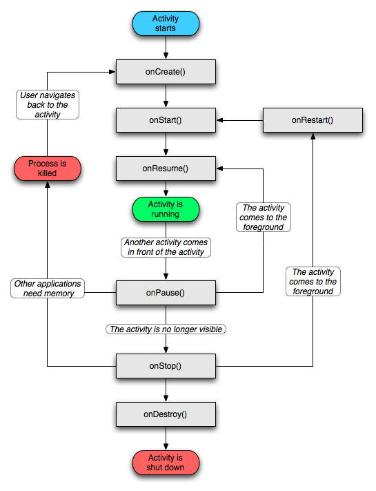
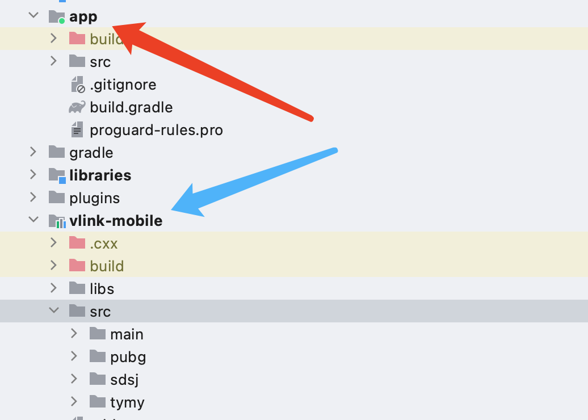
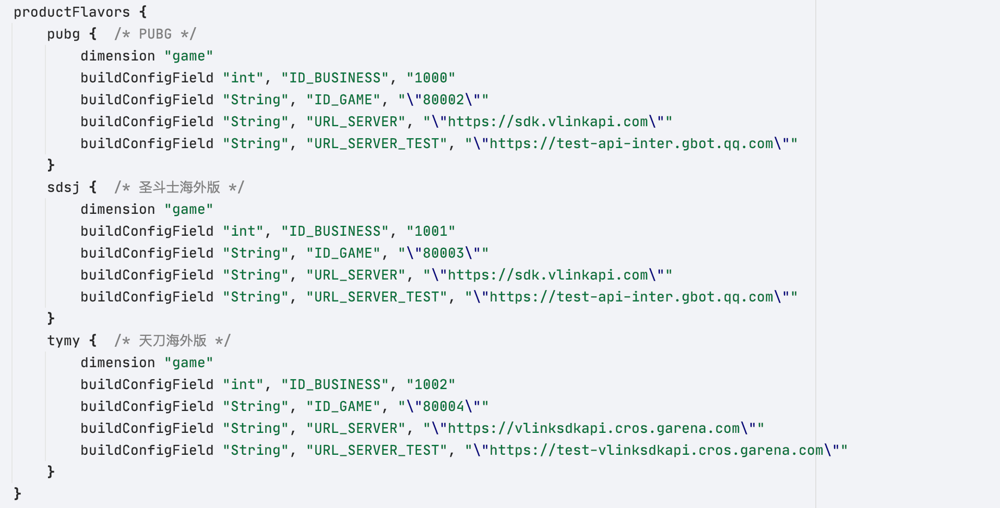
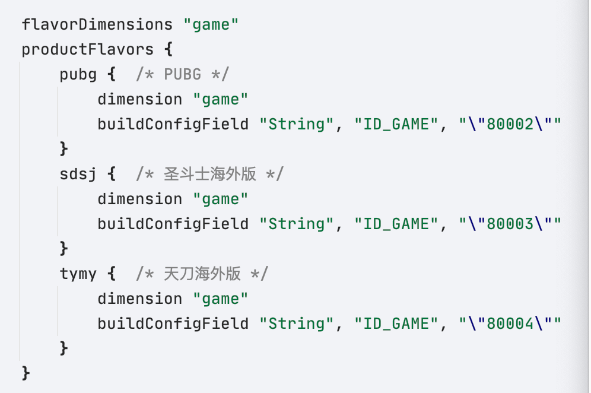
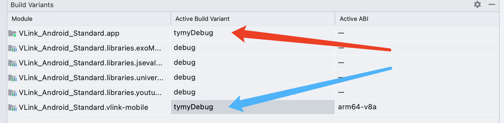

# Tencent_DevNote

2021.06.25-2021.08.31

Shenzhen,Guangdong,China

gestaltxu@tencent.com

## Knowledge

### Activity

#### Activity生命周期



- onResume()：Acitvity运行主方法
- Activity被创建：调用**onCreate()**->onStart()->onResume
- Activity被其他Activity覆盖其上：调用onPause()；Activity被重新放在顶层：调用onResume()
- Activity被锁屏或放入后台：调用onPause()->onStop()；Activity解锁或从后台唤出：调用**onRestart()**->onStart()->onResume()；
- Activity被关闭或退出：调用onPause()->onStop()->**onDestroy**


#### Activity启动模式

**Activity Stack**	返回栈，是Activity任务按照Activity调用顺序排列的栈

- 当前Activity启动另一个Activity时，新Activity会被推送到堆栈顶部，老Activity停止并被压栈在新Activity下
- 返回时，新Activity出栈并被销毁，老Activity恢复状态


**Task**    任务，是一些Activity的集合，以Activity栈的形式存放（即逻辑上的返回栈）


**launchMode**    需在Activity的xml配置文件中进行配置

- stardard：创建已存在于栈内的某个Activity时，新建一个实例并放在栈顶
- singleTop：创建和栈顶相同的Activity时，复用栈顶Activity，不新建实例
- singleTask：创建已存在于栈内的ctivity时，弹出其上所有任务；否则根据taskAffinity属性，选择压入新栈或压入本栈栈顶
- singleInstance：永远根据taskAffinty属性创建新的栈，并将新Activity压入新栈

以上**复用**会回调对应Activity 的**onNewIntent()**方法


**taskAffinity**	需在Activity的xml配置文件中进行配置

用于指定该Activity被配置到哪一个Task内。默认值是本应用的包，如果在同一个包内，一系列singleTask的Activity都不配置taskAffinity，那么他们都会生成在同一个栈内（即：与应用包名相同的栈内）；如果对他们的taskAffinty进行自定义配置，那么singleTask型的新Activity将会根据taskAffinty属性，压入新栈或当前栈顶。


**xml配置示例**

+ 启动模式：单一任务
+ 压栈对象：本应用包

```xml
<activity android:name="com.example.test.SecondActivity"
             android:launchMode="singleTask"
             android:taskAffinity="com.example.test.second">
        </activity>
```


### Service


### Content Provider


### Broadcast Receiver


### Intent


### Context


### Adapter

Adapter用于连接view和view所展示的数据，使用Adapter需要在xml和java中配置

配置xml时，需要：

- 配置view的类型
- 配置android:id="@+id/NAME_OF_THIS_VIEW"
- 配置view的样式

配置java时，需要：

- 定义需要显示的数据
- 通过xxxView = (xxxView) findViewById(R.id.NAME_OF_THIS_VIEW)查找id
- 通过构造函数传参，初始化ArrayAdapter的**item样式**和**数据**

#### ArrayAdapter 数组适配器

只能显示一行文本数据的适配器

```xml
<?xml version="1.0" encoding="utf-8"?>
<LinearLayout
    xmlns:android="http://schemas.android.com/apk/res/android"
    android:layout_width="match_parent"
    android:layout_height="match_parent"
    android:orientation="vertical">
    <ListView
        android:id="@+id/ll1"
        android:layout_width="match_parent"
        android:layout_height="wrap_content">
    </ListView>
</LinearLayout>
```

```java
package com.example.test3;

import android.app.Activity;
import android.os.Bundle;
import android.widget.ArrayAdapter;
import android.widget.ListView;

public class MainActivity extends Activity{
//    定义要显示的数据
    private String[] datas = {"张三","李四","王五","麻子","小强"};
    private ArrayAdapter<String> adapter;
    private ListView listView;
    @Override
    protected void onCreate(Bundle savedInstanceState) {
        super.onCreate(savedInstanceState);
        setContentView(R.layout.activity_main);
        listView = (ListView) findViewById(R.id.ll1);
//        初始化适配器 传参表（this,item样式,数据(String)）
        adapter = new ArrayAdapter<>(this,android.R.layout.simple_expandable_list_item_1,datas);
//        使用适配器配置view
        listView.setAdapter(adapter);
    }
}
```

注意：

- 数据是**String**类型
- item样式是在java中通过**安卓提供的样式**确定的
- ArrayAdapter支持**范型**

#### SimpleAdapter 简单适配器

```xml
<?xml version="1.0" encoding="utf-8"?>
<LinearLayout
    xmlns:android="http://schemas.android.com/apk/res/android"
    android:layout_width="match_parent"
    android:layout_height="match_parent"
    android:orientation="vertical">
    <ListView
        android:id="@+id/ll1"
        android:layout_width="match_parent"
        android:layout_height="wrap_content">
    </ListView>
</LinearLayout>
```

```xml
<?xml version="1.0" encoding="utf-8"?>
<LinearLayout xmlns:android="http://schemas.android.com/apk/res/android"
              android:layout_width="wrap_content"
              android:layout_height="wrap_content"
              android:orientation="horizontal">
    <ImageView
        android:id="@+id/image1"
        android:layout_width="100dp"
        android:layout_height="100dp"
        android:src="@mipmap/ic_launcher"
        android:layout_margin="5dp"/>
   <LinearLayout
       android:id="@+id/ll2"
       android:layout_width="match_parent"
       android:layout_height="100dp"
       android:orientation="vertical"
       android:layout_marginTop="5dp"
       android:layout_marginLeft="10dp">
       <TextView
           android:id="@+id/text1"
           android:layout_width="wrap_content"
           android:layout_height="wrap_content"
           android:text="哈哈"
           android:textSize="30sp"
           android:layout_marginTop="10dp"/>
       <TextView
           android:id="@+id/text2"
           android:layout_width="wrap_content"
           android:layout_height="wrap_content"
           android:text="哈哈哈哈哈"
           android:textSize="24dp"
           android:layout_marginTop="10dp"/>
   </LinearLayout>
</LinearLayout>
```

```java
package com.example.test3;

import android.app.Activity;
import android.os.Bundle;
import android.widget.ListView;
import android.widget.SimpleAdapter;

import java.util.ArrayList;
import java.util.HashMap;
import java.util.List;
import java.util.Map;


public class MainActivity extends Activity{
//    这三个经常是同时出现的
    private List<Map<String,Object>> lists;
    private SimpleAdapter adapter;
    private ListView listView;
//    定义数据
    private String[] theme = {"张三","李四","王五"};
    private String[] content ={"我是张三，你好","我是李四，你好","我是王五，你好"};
    private int[] imageViews = {R.mipmap.ic_launcher,R.mipmap.ic_account,R.mipmap.ic_password};
    @Override
    protected void onCreate(Bundle savedInstanceState) {
        super.onCreate(savedInstanceState);
        setContentView(R.layout.activity_main);
        listView = (ListView) findViewById(R.id.ll1);
//        准备数据源
        lists = new ArrayList<>();
        for(int i = 0;i < theme.length;i++){
            Map<String,Object> map =new HashMap<>();
            map.put("image",imageViews[i]);
            map.put("theme",theme[i]);
            map.put("content",content[i]);
            lists.add(map);
        }
//				 初始化适配器 传参(上下文对象,数据(Map的List),item样式xml文件,每个数据的键值,每个数据的样式的id)
        adapter = new SimpleAdapter(MainActivity.this,lists,R.layout.list_item
                ,new String[]{"image","theme","content"}
                ,new int[]{R.id.image1,R.id.text1,R.id.text2});
//        使用适配器配置view
        listView.setAdapter(adapter);
    }
}
```

注意：

- 数据类型需要配置成**Map**二元组，再以**List**集成
- 需要额外配置view_item的xml样式，并通过其**id**配给对应的数据

#### BaseAdapter 基础适配器

这里同样需要像SimpleAdapter一样，要同时配置view和item的xml样式(下略)

```java
package com.example.test3;

import android.content.Context;
import android.text.Layout;
import android.view.LayoutInflater;
import android.view.View;
import android.view.ViewGroup;
import android.widget.BaseAdapter;
import android.widget.ImageView;
import android.widget.TextView;

import java.util.ArrayList;
import java.util.List;


public class MyAdapter extends BaseAdapter {
    private List<Message> Datas;
    private Context mContext;

    public MyAdapter(List<Message> datas, Context mContext) {
        Datas = datas;
        this.mContext = mContext;
    }

    /**
     * 返回item的个数
     * @return
     */
    @Override
    public int getCount() {
        return Datas.size();
    }

    /**
     * 返回每一个item对象
     * @param i
     * @return
     */
    @Override
    public Object getItem(int i) {
        return Datas.get(i);
    }

    /**
     * 返回每一个item的id
     * @param i
     * @return
     */
    @Override
    public long getItemId(int i) {
        return i;
    }

    /**
     * 暂时不做优化处理，后面会专门整理BaseAdapter的优化
     * @param i
     * @param view
     * @param viewGroup
     * @return
     */
    @Override
    public View getView(int i, View view, ViewGroup viewGroup) {
        view = LayoutInflater.from(mContext).inflate(R.layout.list_item,viewGroup,false);
        ImageView imageView = (ImageView) view.findViewById(R.id.image1);
        TextView textView1 = (TextView) view.findViewById(R.id.text1);
        TextView textView2 = (TextView) view.findViewById(R.id.text2);
        imageView.setImageResource(Datas.get(i).getImageId());
        textView1.setText(Datas.get(i).getTheme());
        textView2.setText(Datas.get(i).getContent());
//        此处需要返回view 不能是view中某一个
        return view;
    }
}
```

```java
package com.example.test3;

import android.app.Activity;
import android.os.Bundle;
import android.widget.ListView;

import java.util.ArrayList;
import java.util.List;


public class MainActivity extends Activity{
//    这三个经常是同时出现的
    private List<Message> lists;
    private MyAdapter adapter;
    private ListView listView;
    @Override
    protected void onCreate(Bundle savedInstanceState) {
        super.onCreate(savedInstanceState);
        setContentView(R.layout.activity_main);
        listView = (ListView) findViewById(R.id.ll1);
        lists = new ArrayList<>();
        lists.add(new Message(R.mipmap.ic_launcher,"张三","你好，我是张三"));
        lists.add(new Message(R.mipmap.ic_account,"李四","你好，我是李四"));
        lists.add(new Message(R.mipmap.ic_password,"王五","你好，我是王五"));
//			初始化适配器，传参（数据(Message的List)，this）
        adapter = new MyAdapter(lists,MainActivity.this);
        listView.setAdapter(adapter);
    }
}
```

注意：

- 一样需要设置item的xml样式
- 需要额外继承BaseAdapter，并**重写getView()方法**，在方法内通过id查找的方式初始化item
- 初始化适配器时，数据的格式是**Message**的**List**


## Project

### VLink

VLink是一个sdk，这里的app只是拿来做测试用的demo，sdk源码都在vlink-mobile模块内。最终该项目的sdk模块部分会打包为arr

需要给不同的游戏对接，因此提前写好对应不同游戏的sdk版本(pubg,sdsj,tymy)。这需要修改vlink-mobile模块的build.gradle，设置productFlavors的buildConfigField参数来控制对应不同手游的sdk版本。



测试时，demo app的build.gradle也需要更改版本



编译前需用Build Variants选择sdk模块构建的版本。

测试时还需同时选择app demo的版本。



### SCLog


## Reference

- Android 四大组件 https://www.jianshu.com/p/51aaa65d5d25
- Android组件化、模块化实现 https://www.jianshu.com/p/a7f256e50d2f

- Android JNI笔记 https://www.jianshu.com/p/87ce6f565d37
- Android NDK官方文档 https://developer.android.google.cn/ndk/guides
- C++ Abseil 概览 https://zhuanlan.zhihu.com/p/29940200

- C++ Google规范 https://google.github.io/styleguide/cppguide.html

- Git 文档全书 https://git-scm.com/book/zh/v2

