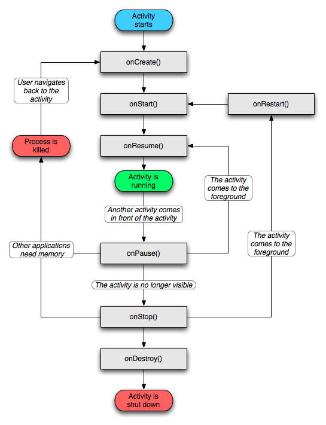
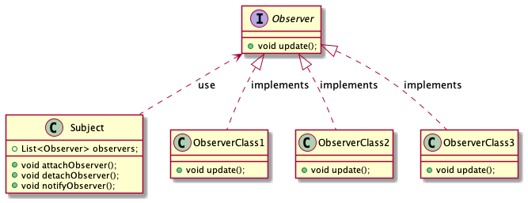
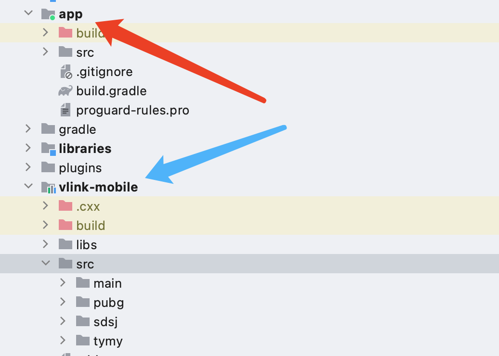
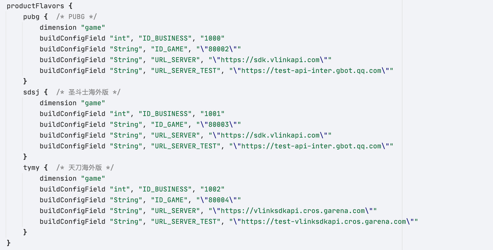
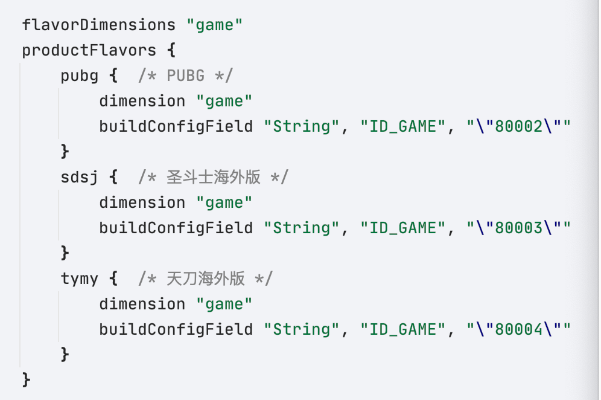
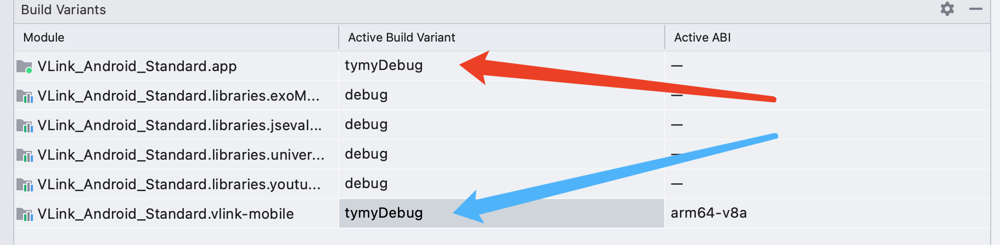
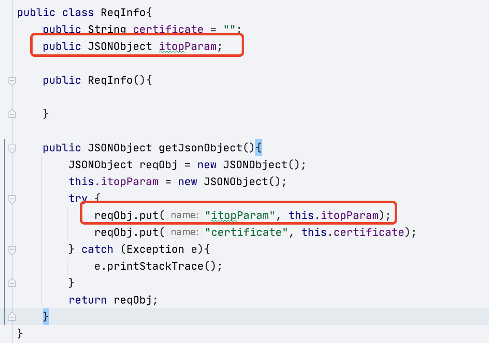
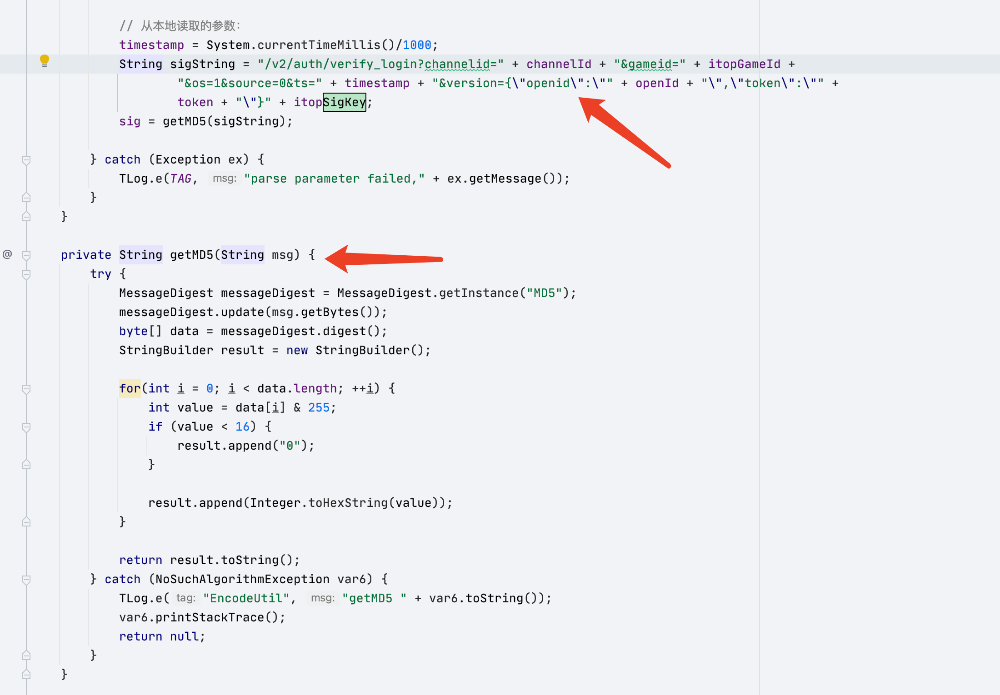
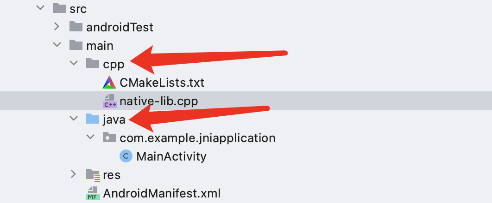
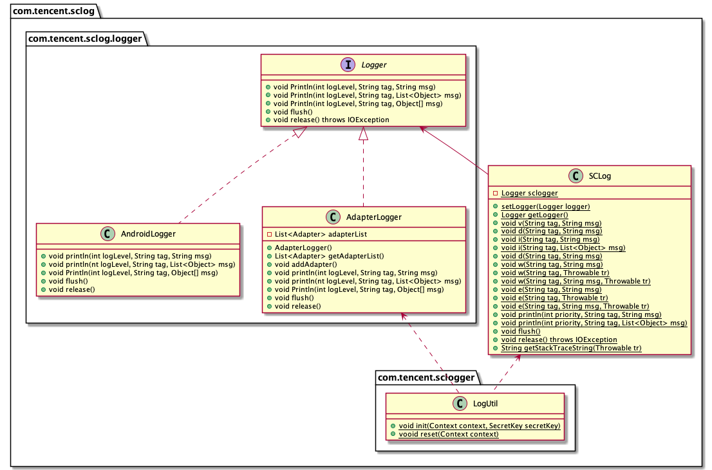

# Tencent_DevNote

2021.06.25-Unknown

Shenzhen,China

gestaltxu@tencent.com

## Knowledge

### 1. Android

#### Activity

##### Activity生命周期



- onResume()：Acitvity运行主方法
- Activity被创建：调用**onCreate()**->onStart()->onResume
- Activity被其他Activity覆盖其上：调用onPause()；Activity被重新放在顶层：调用onResume()
- Activity被锁屏或放入后台：调用onPause()->onStop()；Activity解锁或从后台唤出：调用**onRestart()**->onStart()->onResume()；
- Activity被关闭或退出：调用onPause()->onStop()->**onDestroy**


#### Activity启动模式

**Activity Stack**	返回栈，是Activity任务按照Activity调用顺序排列的栈

- 当前Activity启动另一个Activity时，新Activity会被推送到堆栈顶部，老Activity停止并被压栈在新Activity下
- 返回时，新Activity出栈并被销毁，老Activity恢复状态


**Task**    任务，是一些Activity的集合，以Activity栈的形式存放（即逻辑上的返回栈）


**launchMode**    需在Activity的xml配置文件中进行配置

- stardard：创建已存在于栈内的某个Activity时，新建一个实例并放在栈顶
- singleTop：创建和栈顶相同的Activity时，复用栈顶Activity，不新建实例
- singleTask：创建已存在于栈内的ctivity时，弹出其上所有任务；否则根据taskAffinity属性，选择压入新栈或压入本栈栈顶
- singleInstance：永远根据taskAffinty属性创建新的栈，并将新Activity压入新栈

以上**复用**会回调对应Activity 的**onNewIntent()**方法


**taskAffinity**	需在Activity的xml配置文件中进行配置

用于指定该Activity被配置到哪一个Task内。默认值是本应用的包，如果在同一个包内，一系列singleTask的Activity都不配置taskAffinity，那么他们都会生成在同一个栈内（即：与应用包名相同的栈内）；如果对他们的taskAffinty进行自定义配置，那么singleTask型的新Activity将会根据taskAffinty属性，压入新栈或当前栈顶。


**xml配置示例**

+ 启动模式：单一任务
+ 压栈对象：本应用包

```xml
<activity android:name="com.example.test.SecondActivity"
             android:launchMode="singleTask"
             android:taskAffinity="com.example.test.second">
        </activity>
```

#### Service

Service可以没有界面，从而作为后台进程存在。

#### Content Provider

#### Broadcast Receiver

#### Intent

#### Context

#### Adapter

Adapter用于连接view和view所展示的数据，使用Adapter需要在xml和java中配置

配置xml时，需要：

- 配置view的类型
- 配置android:id="@+id/NAME_OF_THIS_VIEW"
- 配置view的样式

配置java时，需要：

- 定义需要显示的数据
- 通过xxxView = (xxxView) findViewById(R.id.NAME_OF_THIS_VIEW)查找id
- 通过构造函数传参，初始化ArrayAdapter的**item样式**和**数据**

#### ArrayAdapter 数组适配器

只能显示一行文本数据的适配器

```xml
<?xml version="1.0" encoding="utf-8"?>
<LinearLayout
    xmlns:android="http://schemas.android.com/apk/res/android"
    android:layout_width="match_parent"
    android:layout_height="match_parent"
    android:orientation="vertical">
    <ListView
        android:id="@+id/ll1"
        android:layout_width="match_parent"
        android:layout_height="wrap_content">
    </ListView>
</LinearLayout>
```

```java
package com.example.test3;

import android.app.Activity;
import android.os.Bundle;
import android.widget.ArrayAdapter;
import android.widget.ListView;

public class MainActivity extends Activity{
//    定义要显示的数据
    private String[] datas = {"张三","李四","王五","麻子","小强"};
    private ArrayAdapter<String> adapter;
    private ListView listView;
    @Override
    protected void onCreate(Bundle savedInstanceState) {
        super.onCreate(savedInstanceState);
        setContentView(R.layout.activity_main);
        listView = (ListView) findViewById(R.id.ll1);
//        初始化适配器 传参表（this,item样式,数据(String)）
        adapter = new ArrayAdapter<>(this,android.R.layout.simple_expandable_list_item_1,datas);
//        使用适配器配置view
        listView.setAdapter(adapter);
    }
}
```

注意：

- 数据是**String**类型
- item样式是在java中通过**安卓提供的样式**确定的
- ArrayAdapter支持**范型**

#### SimpleAdapter 简单适配器

```xml
<?xml version="1.0" encoding="utf-8"?>
<LinearLayout
    xmlns:android="http://schemas.android.com/apk/res/android"
    android:layout_width="match_parent"
    android:layout_height="match_parent"
    android:orientation="vertical">
    <ListView
        android:id="@+id/ll1"
        android:layout_width="match_parent"
        android:layout_height="wrap_content">
    </ListView>
</LinearLayout>
```

```xml
<?xml version="1.0" encoding="utf-8"?>
<LinearLayout xmlns:android="http://schemas.android.com/apk/res/android"
              android:layout_width="wrap_content"
              android:layout_height="wrap_content"
              android:orientation="horizontal">
    <ImageView
        android:id="@+id/image1"
        android:layout_width="100dp"
        android:layout_height="100dp"
        android:src="@mipmap/ic_launcher"
        android:layout_margin="5dp"/>
   <LinearLayout
       android:id="@+id/ll2"
       android:layout_width="match_parent"
       android:layout_height="100dp"
       android:orientation="vertical"
       android:layout_marginTop="5dp"
       android:layout_marginLeft="10dp">
       <TextView
           android:id="@+id/text1"
           android:layout_width="wrap_content"
           android:layout_height="wrap_content"
           android:text="哈哈"
           android:textSize="30sp"
           android:layout_marginTop="10dp"/>
       <TextView
           android:id="@+id/text2"
           android:layout_width="wrap_content"
           android:layout_height="wrap_content"
           android:text="哈哈哈哈哈"
           android:textSize="24dp"
           android:layout_marginTop="10dp"/>
   </LinearLayout>
</LinearLayout>
```

```java
package com.example.test3;

import android.app.Activity;
import android.os.Bundle;
import android.widget.ListView;
import android.widget.SimpleAdapter;

import java.util.ArrayList;
import java.util.HashMap;
import java.util.List;
import java.util.Map;


public class MainActivity extends Activity{
//    这三个经常是同时出现的
    private List<Map<String,Object>> lists;
    private SimpleAdapter adapter;
    private ListView listView;
//    定义数据
    private String[] theme = {"张三","李四","王五"};
    private String[] content ={"我是张三，你好","我是李四，你好","我是王五，你好"};
    private int[] imageViews = {R.mipmap.ic_launcher,R.mipmap.ic_account,R.mipmap.ic_password};
    @Override
    protected void onCreate(Bundle savedInstanceState) {
        super.onCreate(savedInstanceState);
        setContentView(R.layout.activity_main);
        listView = (ListView) findViewById(R.id.ll1);
//        准备数据源
        lists = new ArrayList<>();
        for(int i = 0;i < theme.length;i++){
            Map<String,Object> map =new HashMap<>();
            map.put("image",imageViews[i]);
            map.put("theme",theme[i]);
            map.put("content",content[i]);
            lists.add(map);
        }
//				 初始化适配器 传参(上下文对象,数据(Map的List),item样式xml文件,每个数据的键值,每个数据的样式的id)
        adapter = new SimpleAdapter(MainActivity.this,lists,R.layout.list_item
                ,new String[]{"image","theme","content"}
                ,new int[]{R.id.image1,R.id.text1,R.id.text2});
//        使用适配器配置view
        listView.setAdapter(adapter);
    }
}
```

注意：

- 数据类型需要配置成**Map**二元组，再以**List**集成
- 需要额外配置view_item的xml样式，并通过其**id**配给对应的数据

#### BaseAdapter 基础适配器

这里同样需要像SimpleAdapter一样，要同时配置view和item的xml样式(下略)

```java
package com.example.test3;

import android.content.Context;
import android.text.Layout;
import android.view.LayoutInflater;
import android.view.View;
import android.view.ViewGroup;
import android.widget.BaseAdapter;
import android.widget.ImageView;
import android.widget.TextView;

import java.util.ArrayList;
import java.util.List;


public class MyAdapter extends BaseAdapter {
    private List<Message> Datas;
    private Context mContext;

    public MyAdapter(List<Message> datas, Context mContext) {
        Datas = datas;
        this.mContext = mContext;
    }

    /**
     * 返回item的个数
     * @return
     */
    @Override
    public int getCount() {
        return Datas.size();
    }

    /**
     * 返回每一个item对象
     * @param i
     * @return
     */
    @Override
    public Object getItem(int i) {
        return Datas.get(i);
    }

    /**
     * 返回每一个item的id
     * @param i
     * @return
     */
    @Override
    public long getItemId(int i) {
        return i;
    }

    /**
     * 暂时不做优化处理，后面会专门整理BaseAdapter的优化
     * @param i
     * @param view
     * @param viewGroup
     * @return
     */
    @Override
    public View getView(int i, View view, ViewGroup viewGroup) {
        view = LayoutInflater.from(mContext).inflate(R.layout.list_item,viewGroup,false);
        ImageView imageView = (ImageView) view.findViewById(R.id.image1);
        TextView textView1 = (TextView) view.findViewById(R.id.text1);
        TextView textView2 = (TextView) view.findViewById(R.id.text2);
        imageView.setImageResource(Datas.get(i).getImageId());
        textView1.setText(Datas.get(i).getTheme());
        textView2.setText(Datas.get(i).getContent());
//        此处需要返回view 不能是view中某一个
        return view;
    }
}
```

```java
package com.example.test3;

import android.app.Activity;
import android.os.Bundle;
import android.widget.ListView;

import java.util.ArrayList;
import java.util.List;


public class MainActivity extends Activity{
//    这三个经常是同时出现的
    private List<Message> lists;
    private MyAdapter adapter;
    private ListView listView;
    @Override
    protected void onCreate(Bundle savedInstanceState) {
        super.onCreate(savedInstanceState);
        setContentView(R.layout.activity_main);
        listView = (ListView) findViewById(R.id.ll1);
        lists = new ArrayList<>();
        lists.add(new Message(R.mipmap.ic_launcher,"张三","你好，我是张三"));
        lists.add(new Message(R.mipmap.ic_account,"李四","你好，我是李四"));
        lists.add(new Message(R.mipmap.ic_password,"王五","你好，我是王五"));
//			初始化适配器，传参（数据(Message的List)，this）
        adapter = new MyAdapter(lists,MainActivity.this);
        listView.setAdapter(adapter);
    }
}
```

注意：

- 一样需要设置item的xml样式
- 需要额外继承BaseAdapter，并**重写getView()方法**，在方法内通过id查找的方式初始化item
- 初始化适配器时，数据的格式是**Message**的**List**


### 2. Node.js

非阻塞、事件驱动

#### 命令行交互与npm

终端输入`node`即可进入环境。支持JavaScript的多行表达式。使用`ctrl+c`退出环境

使用`node <File Name>`即可使用Node.js运行js脚本。

npm是Node.js自带的包管理工具，如同pip之于python。安装模块的语法如下：

- 本地安装：本地安装包将放在./node_modules目录下。通过require()进行引入。发布时，这些依赖项会一起打包

  `npm install <Module Name>`

- 全局安装：全局安装包放在/usr/local目录下（或者node自定义目录下）。可以在命令行中使用

  `npm install <Module Name> -g`

#### 异步

Node.js的异步编程依托于回调函数实现。回调函数在**完成任务后**会被调用。例如对于有文件I/O操作的代码，Node.js执行代码时，没有阻塞和等待文件I/O的操作，而是在文件读取完成之后再把文件内容以回调函数的**参数**的形式返回。

通常回调的参数放在最后面：

```js
function foo1(param,callback){}
function foo2(param,callback1,callback2){}
```

例如，对于同步代码：

```js
//main.js
var fs = require("fs");
var data = fs.readFileSync('input.txt');
console.log(data.toString());
console.log("Process Terminated");
```

输出为：

```
hello world!
hello my friend!

Process_Terminated
```

而对于异步代码：

```js
//main.js
var fs = require("fs");
fs.readFile('input.txt', function (err, data) {
    if (err) return console.error(err);
    console.log(data.toString());
});
console.log("程序执行结束!");
```

输出为：

```
Process_Terminated
hello world!
hello my friend!

```

可见，脚本对于`input.txt`的I/O操作并没有阻塞后续脚本代码的执行。


Node.js 是单进程单线程应用程序，但是因为 V8 引擎提供的异步执行回调接口，通过这些接口可以处理大量的并发，所以性能非常高。基本上所有的Node.js事件机制都是**观察者模式**实现。Node.js 单线程类似进入一个while(true)的事件循环，直到没有事件观察者退出，每个异步事件都生成一个事件观察者，如果有事件发生就调用该回调函数。



Node.js采用事件驱动模型，web server收到请求，则进行后台处理，然后服务下一个web请求。当前请求处理完成，则放入队列。请求结果到达队列开头时，返回给用户。


Node.js拥有多个内置事件。可以引入events模块、实例化EventEmitter类来**绑定**、**监听**和**处理**事件,如：

```js
// 引入 events 模块
var events = require('events');
// 创建 eventEmitter 对象
var eventEmitter = new events.EventEmitter(); 
// 创建事件处理程序
var connectHandler = function connected() {
   console.log('connected successfully!');  
   // 触发 data_received 事件
   eventEmitter.emit('data_received');
}
// 绑定 connection 事件处理程序
eventEmitter.on('connection', connectHandler);
// 绑定 data_received 事件处理程序（匿名函数）
eventEmitter.on('data_received', function(){
   console.log('data received successfully!');
});
// 触发 connection 事件
eventEmitter.emit('connection');
console.log("process terminated!");
```

输出为：

```js
connected successfully!
data received successfully!
process terminated!
```

实际使用时，我们不会直接使用EventEmitter，而是**继承**它。

更多关于EventEmitter的方法，参见https://www.runoob.com/nodejs/nodejs-event.html


#### 缓冲

Node.js定义了JavaScript所没有的buffer类，用于缓冲TCP流或文件流的二进制数据。建议通过`Buffer.from()`接口区创建Buffer对象。参数可以是array、arrayBuffer和String。传入String时，需要确定encoding，否则默认为UTF-8编码。如：

```js
//UTF-8字节:[0x74, 0xc3, 0xa9, 0x73, 0x74]
const buf1 = Buffer.from('test')；
//ascii字节:[0x74, 0xc3, 0xa9, 0x73, 0x74]
const buf2 = Buffer.from('test','ascii');
//[0x1, 0x2, 0x3]
const buf3 = Buffer.from([1,2,3]);
```

写入缓冲区，使用`buf.write(string)`方法，返回实际写入的长度

读出缓冲区，使用`buf.toString(encoding)`方法，返回**指定编码**的字符串

更多关于Buffer的方法，参见https://www.runoob.com/nodejs/nodejs-buffer.html


#### 流

Node.js有很多对象实现了Stream这个接口。使用可读流和可写流需要引入包`require("fs");`

1. 流式读取demo：

   ```js
   var fs = require("fs");
   var data = '';
   
   // 创建可读流
   var readerStream = fs.createReadStream('input.txt');
   
   // 设置编码为 utf8。
   readerStream.setEncoding('UTF8');
   
   // 处理流事件 --> data, end, and error
   readerStream.on('data', function(chunk) {
      data += chunk;
   });
   
   readerStream.on('end',function(){
      console.log(data);
   });
   
   readerStream.on('error', function(err){
      console.log(err.stack);
   });
   
   console.log("Process Terminated");
   ```

2. 流式写入demo：

   ```js
   var fs = require("fs");
   var data = '菜鸟教程官网地址：www.runoob.com';
   
   // 创建一个可以写入的流，写入到文件 output.txt 中
   var writerStream = fs.createWriteStream('output.txt');
   
   // 使用 utf8 编码写入数据
   writerStream.write(data,'UTF8');
   
   // 标记文件末尾
   writerStream.end();
   
   // 处理流事件 --> finish、error
   writerStream.on('finish', function() {
       console.log("写入完成。");
   });
   
   writerStream.on('error', function(err){
      console.log(err.stack);
   });
   
   console.log("Process Terminated");
   ```

3. 管道流demo：

   ```js
   var fs = require("fs");
   
   // 创建一个可读流
   var readerStream = fs.createReadStream('input.txt');
   
   // 创建一个可写流
   var writerStream = fs.createWriteStream('output.txt');
   
   // 管道读写操作
   // 读取 input.txt 文件内容，并将内容写入到 output.txt 文件中
   readerStream.pipe(writerStream);
   
   console.log("Process Terminated");
   ```

4. 链式流demo：

   ```js
   var fs = require("fs");
   var zlib = require('zlib');
   
   // 压缩 input.txt 文件为 input.txt.gz
   fs.createReadStream('input.txt')
     .pipe(zlib.createGzip())
     .pipe(fs.createWriteStream('input.txt.gz'));
     
   console.log("File zipped");
   ```

   ```js
   var fs = require("fs");
   var zlib = require('zlib');
   
   // 解压 input.txt.gz 文件为 input.txt
   fs.createReadStream('input.txt.gz')
     .pipe(zlib.createGunzip())
     .pipe(fs.createWriteStream('input.txt'));
     
   console.log("File unzipped");
   ```


### 3.OS

#### 静态链接/动态链接

我们在编写代码的时候经常用到已有的接口，他们是以库的形式提供给我们使用的，而常见形式有两种，一种常以.a为后缀，为静态库；另一种以.so为后缀，为动态库。那么这两种库有什么区别呢？

说明：本文主要说明Linux下的情况，windows不涉及。


##### 目标文件

在解释静态库和动态库之前，需要简单了解一下什么是目标文件。目标文件常常按照特定格式来组织，在linux下，它是ELF格式（Executable Linkable Format，可执行可链接格式），而在windows下是PE（Portable Executable，可移植可执行）。

而通常目标文件有三种形式：

- 可执行目标文件。即我们通常所认识的，可直接运行的二进制文件。
- 可重定位目标文件。包含了二进制的代码和数据，可以与其他可重定位目标文件合并，并创建一个可执行目标文件。
- 共享目标文件。它是一种在加载或者运行时进行链接的特殊可重定位目标文件。

我们来看一个简单实例：

```c
//main.c
#include<stdio.h>
#include<math.h>
int main(int argc,char *argv[])
{
    printf("hello world\n");
    int b = 2;
    double a = exp(b);
    printf("%lf\n",a);
    return 0;
}
```

代码计算e的2次方并打印结果。由于代码中用到了exp函数，它位于数学库libm.so或者libm.a中，因此编译时需要加上-lm。

生成可重定位目标文件main.o:

```text
$ gcc -c main.c   #生成可重定位目标文件
$ readelf -h main.o  #查看elf文件头部信息
ELF Header:
  Magic:   7f 45 4c 46 02 01 01 00 00 00 00 00 00 00 00 00 
  Class:                             ELF64
  Data:                              2's complement, little endian
  Version:                           1 (current)
  OS/ABI:                            UNIX - System V
  ABI Version:                       0
  Type:                              REL (Relocatable file)
(省略其他内容)
```

通过上面的命令将main.c生成为可重定位目标文件。通过readelf命令也可以看出来：REL (Relocatable file)。

观察共享目标文件libm.so：

```text
$ readelf -h /lib/x86_64-linux-gnu/libm.so.6
ELF Header:
  Magic:   7f 45 4c 46 02 01 01 03 00 00 00 00 00 00 00 00 
  Class:                             ELF64
  Data:                              2's complement, little endian
  Version:                           1 (current)
  OS/ABI:                            UNIX - GNU
  ABI Version:                       0
  Type:                              DYN (Shared object file)
（省略其他内容）
```

不同系统中libm.so的位置可能不一样，你可以通过locate命令来查找。locate命令的用法可参考《[Linux中的文件查找技巧](https://link.zhihu.com/?target=https%3A//www.yanbinghu.com/2018/11/24/18359.html)》。从结果可以看到，libm.so是共享目标文件（Shared object file）。

查看可执行目标文件main：

```text
$ gcc -o main main.o -lm  #编译成最终的可执行文件
$ readelf -h main         #查看ELF文件头
ELF Header:
  Magic:   7f 45 4c 46 02 01 01 00 00 00 00 00 00 00 00 00 
  Class:                             ELF64
  Data:                              2's complement, little endian
  Version:                           1 (current)
  OS/ABI:                            UNIX - System V
  ABI Version:                       0
  Type:                              EXEC (Executable file)
(省略其他内容)
```

这里必须要强调一点，**如果使用到的函数没有在libc库中，那么你就需要指定要链接的库**，本文中需要链接libm.so或libm.a。可以看到，最终生成的main类型是Executable file，即可执行目标文件。


##### 静态库

前面所提到可重定位目标文件以一种特定的方式打包成一个单独的文件，并且在链接生成可执行文件时，从这个单独的文件中“拷贝”它自己需要的内容到最终的可执行文件中。这个单独的文件，称为静态库。linux中通常以.a(archive)为后缀

还是拿前面的例子来说，我们使用静态链接构建我们的可执行文件：

```text
$ gcc -c main.c
$ gcc -static -o main main.o -lm
```

在这个过程中，就会用到系统中的静态库libm.a。这个过程做了什么呢？首先第一条命令会将main.c编译成**可重定位目标文件**main.o，第二条命令的static参数，告诉链接器应该使用静态链接，-lm参数表明链接libm.a这个库（类似的，如果要链接libxxx.a,使用-lxxx即可）。由于main.c中使用了libm.a中的exp函数，因此链接时，会将libm.a中需要的代码“拷贝”到最终的可执行文件main中。

特别注意，必须把-lm放在后面。放在最后时它是这样的一个解析过程：

- 链接器从左往右扫描可重定位目标文件和静态库
- 扫描main.o时，发现一个未解析的符号exp，记住这个未解析的符号
- 扫描libm.a，找到了前面未解析的符号，因此提取相关代码
- 最终没有任何未解析的符号，编译链接完成

那如果将-lm放在前面，又是怎样的情况呢？

- 链接器从左往右扫描可重定位目标文件和静态库
- 扫描libm.a，由于前面没有任何未解析的符号，因此不会提取任何代码
- 扫描main.o，发现未解析的符号exp
- 扫描结束，还有一个未解析的符号，因此编译链接报错

如果把-lm放在前面，编译结果如下：

```text
$ gcc -static -lm -o main main.o 
main.o: In function `main':
main.c:(.text+0x2f): undefined reference to `exp'
collect2: error: ld returned 1 exit status
```

更详细的解释也可以参考《[一个奇怪的链接问题](https://link.zhihu.com/?target=https%3A//www.yanbinghu.com/2018/10/06/46212.html)》。

我们看看最终生成的文件大小：

```text
$ ls -lh main
-rwxrwxr-x 1 hyb hyb 988K 6月  27 20:22 main
```

生成的可执行文件大小为988k。ls的高级用法可参考《[ls命令常见实用用法](https://link.zhihu.com/?target=https%3A//www.yanbinghu.com/2018/09/16/51043.html)》。

由于最终生成的可执行文件中已经包含了exp相关的二进制代码，因此这个可执行文件在一个没有libm.a的linux系统中也能正常运行。


##### 动态库

动态库和静态库类似，但是它并不在链接时将需要的二进制代码都“拷贝”到可执行文件中，而是仅仅“拷贝”一些重定位和符号表信息，这些信息可以在程序运行时完成真正的链接过程。linux中通常以.so（shared object）作为后缀。

通常我们编译的程序默认就是实用动态链接：

```text
$ gcc -o main main.c -lm  #默认使用的是动态链接
```

我们来看最终生成的文件大小：

```text
$ ls -lh main
-rwxrwxr-x 1 hyb hyb 8.5K 6月  27 20:25 main
```

可以看到，通过动态链接的程序**只有8.5k**！

另外我们还可以通过ldd命令来观察可执行文件链接了哪些动态库：

```text
$ ldd main
    linux-vdso.so.1 =>  (0x00007ffc7b5a2000)
    libm.so.6 => /lib/x86_64-linux-gnu/libm.so.6 (0x00007fe9642bf000)
    libc.so.6 => /lib/x86_64-linux-gnu/libc.so.6 (0x00007fe963ef5000)
    /lib64/ld-linux-x86-64.so.2 (0x00007fe9645c8000)
```

正因为我们并没有把libm.so中的二进制代码“拷贝”可执行文件中，我们的程序在其他没有上面的动态库时，将无法正常运行。


##### 区别

到这里我们大致了解了静态库和动态库的区别了，静态库被使用目标代码最终和可执行文件在一起（它只会有自己用到的），而动态库与它相反，它的目标代码在运行时或者加载时链接。正是由于这个区别，会导致下面所介绍的这些区别。

- 可执行文件大小不一样

从前面也可以观察到，静态链接的可执行文件要比动态链接的可执行文件要大得多，因为它将需要用到的代码从二进制文件中“拷贝”了一份，而动态库仅仅是复制了一些重定位和符号表信息。

- 占用磁盘大小不一样

如果有多个可执行文件，那么静态库中的同一个函数的代码就会被复制多份，而动态库只有一份，因此使用静态库占用的磁盘空间相对比动态库要大。

- 扩展性与兼容性不一样

如果静态库中某个函数的实现变了，那么可执行文件必须重新编译，而对于动态链接生成的可执行文件，只需要更新动态库本身即可，不需要重新编译可执行文件。正因如此，使用动态库的程序方便升级和部署。

- 依赖不一样

静态链接的可执行文件不需要依赖其他的内容即可运行，而动态链接的可执行文件必须依赖动态库的存在。所以如果你在安装一些软件的时候，提示某个动态库不存在的时候也就不奇怪了。

即便如此，系统中一班存在一些大量公用的库，所以使用动态库并不会有什么问题。

- 复杂性不一样

相对来讲，动态库的处理要比静态库要复杂，例如，如何在运行时确定地址？多个进程如何共享一个动态库？当然，作为调用者我们不需要关注。另外动态库版本的管理也是一项技术活。这也不在本文的讨论范围。

- 加载速度不一样

由于静态库在链接时就和可执行文件在一块了，而动态库在加载或者运行时才链接，因此，对于同样的程序，静态链接的要比动态链接加载更快。所以选择静态库还是动态库是空间和时间的考量。但是通常来说，牺牲这点性能来换取程序在空间上的节省和部署的灵活性时值得的。再加上**局部性原理**，牺牲的性能并不多。

##### 总结

静态库和动态库具体是何如链接的已经超出了本文的介绍范围，本文仅简单介绍了一些静态库和动态库的区别，另外文中提到的在其他的linux系统，也指的是同样处理器架构的系统。但是了解这些基本信息，就能够帮助我们解决很多编译问题了。更多内容可自己阅读装载，链接方面的书籍。后面的文章也会介绍更多相关信息。


### 4. C++

cmake命令不区分大小写

#### CMakeList.txt

**必备**设置最小版本号与项目名

```cmake
cmake_minimum_required (VERSION versionNumber [FATAL_ERROR])
project(projectName [CXX] [C] [Java])
```


显示定义变量或为已有变量赋值

```cmake
set(var [value])
```

之后可以用`${var}`的方式引用全局变量。全局所有该标记将会被替换为对应的变量值。


向工程中添加多个特定的**头文件搜索路径**

```cmake
include_directories([after/before] [system] dir1 dir2 ... dirn)
```


将指定**源文件编译成链接库**（fileName.a/fileName.so）

```cmake
add_library(fileName) [SHARED/STATIC]
```


向工程中增加可执行文件

```cmake
add_executable(fileName ${fileSource})
```

指定生成fileName可执行文件。${fileSource}是其相关源文件列表


添加**非标准共享库的路径**（静态/动态链接库）

```cmake
link_directories(dir1 dir2 ... dirn)
```


为target**链接**所需的库

```cmake
target_link_libraries(target lib1 lib2)
```


#### operator

Operator用于C++的运算符重载，同时也可用于隐式类型转换`operator param() {}`，看下面这个例

```cpp
#include <iostream>
template<typename _T>
class A {
public:
	A(_T a) : data(a) {}
	operator _T () { return data; }
private:
	_T data;
};

int main() {
	A<int> obj(2);
	obj = obj + 1;
	std::cout << obj << std::endl;
	return 0;
}
```

程序输出为3，因为obj = obj + 1将调用运算符重载，将obj的data成员返回。


## Project

### VLink

#### 结构

VLink是一个sdk，这里的app只是拿来做测试用的demo，sdk源码都在vlink-mobile模块内。最终该项目的sdk模块部分会打包为arr

需要给不同的游戏对接，因此提前写好对应不同游戏的sdk版本(pubg,sdsj,tymy)。这需要修改vlink-mobile模块的build.gradle，设置productFlavors的buildConfigField参数来控制对应不同手游的sdk版本。



测试时，demo app的build.gradle也需要更改版本



编译前需用Build Variants选择sdk模块构建的版本。

测试时还需同时选择app demo的版本。



#### 传参

VLink-Android需要和iOS一样，保持和后台一致的传参。这需要统一JSON包的格式。

参数最初从游戏端传入。开发阶段，参数从demo手动传入（JSON转字符串或直接传JSON字符串）。传参流程为：


**流程：**	从demo读取的json参数传入SDK的GameParameter类，值传给对应变量。ReqEngine类从GameParamter类读取参数，放入ReqInfo类内。ReqInfo会格式化将要发送到服务端的json信息。之后ReqInfo写入JSON，并发送给服务端。

本次传参需要额外增加一个itopParam结构。因此需要更新ReqInfo类的结构。内部增加一个json结构：



itopParam内具有时间戳和数字签名。时间戳需要使用java获取系统时间，数字签名需要额外加入MD5加密的函数：



其余itopParam参数，在GameParameter和ReqInfo等类内增设成员变量即可。

### SCLog

#### JNI基础

##### JNI项目结构：



AS的JNI项目会增加cpp目录。该目录包含native的cpp库以及CMakeList。java类内可以调用cpp库的方法。

AS新建空JNI项目，main目录下的java和cpp：

MainActivity.java:

```java
public class MainActivity extends AppCompatActivity {

    // 加载的library名称，注意：不是C++文件的名称
    static {
        System.loadLibrary("native-lib");
    }
    private ActivityMainBinding binding;
    /**
     * java中定义方法的名称，会根据包名、类名、参数、返回值类型寻找对应的C++方法
     */
    public native String stringFromJNI();
}
```

native-lib.cpp:

```C++
//对应于java中的stringFromJNI方法
extern "C" JNIEXPORT jstring JNICALL
Java_com_example_jniapplication_MainActivity_stringFromJNI(
        JNIEnv* env,
        jobject /* this */) {
    std::string hello = "Hello from C++";
  	//返回值转义为const char*
    return env->NewStringUTF(hello.c_str());
}
```

细节：

- Java部分
  Java部分主要做了两件事情：

  1. 加载动态库

     因为动态库只需要加载一次，所以一般我们会在类的静态代码块中进行加载，这样还有个好处就是早出错，早发现

     ```java
     static {
         System.loadLibrary("native-lib");
     }
     ```

  2. native函数声明

     以下声明表示这个函数是native函数，什么参数也不传，回传一个String

     ```java
     public native String stringFromJNI();
     ```

- native部分
  native函数的实现：
  函数标识：`extern "C" JNIEXPORT`
  回传值类型：`jstring`
  参数类型：自动添加了`JNIEnv*`和`jobject`

  ```cpp
  extern "C" JNIEXPORT jstring JNICALL Java_com_wsy_jnidemo_MainActivity_stringFromJNI(
      JNIEnv *env,
      jobject /* this */){
      std::string hello = "Hello from C++";
      return env->NewStringUTF(hello.c_str());
  }
  ```

`extern "C"`：声明以下编译方式为C语言编译而非C++

`JNIEXPORT`：宏，声明了函数可见性为default

`JNICALL`：宏，空的(?)

- CMakeLists部分

  ```cmake
  # 声明最低的cmake版本
  cmake_minimum_required(VERSION 3.4.1)
  # 添加一个名称叫native-lib的动态库，该库的源文件为src/main/native-lib.cpp
  add_library( native-lib # 库的名称
               SHARED # SHARED:动态库、STATIC:静态库
               src/main/native-lib.cpp # 源文件，可以是多个
               )
               
  # 寻找系统中的log库，保存在log-lib变量中
  find_library( log-lib 
                log )
                
  # native-lib这个库会去依赖log-lib这个库
  target_link_libraries( native-lib
                         ${log-lib} )
  ```


##### JNI类型转换

oracle给出了native和java的基本类型转换表：

| Java Type | Native Type | Description      |
| --------- | ----------- | ---------------- |
| boolean   | jboolean    | unsigned 8 bits  |
| byte      | jbyte       | signed 8 bits    |
| char      | jchar       | unsigned 16 bits |
| short     | jshort      | signed 16 bits   |
| int       | jint        | signed 32 bits   |
| long      | jlong       | signed 64 bits   |
| float     | jfloat      | 32 bits          |
| double    | jdouble     | 64 bits          |
| void      | void        | N/A              |


##### JNI函数注册

JNI函数的注册一般分为两种：**静态注册和动态注册**。

- 静态注册通过固定的命名规则映射Java和native函数，如：

  1. 在java中定义好将要使用的native方法：

     ```java
     public native void testCallJava(MainActivity activity)
     ```

  2. 在cpp中定义对应的native方法：

     ```cpp
     xtern "C" JNIEXPORT void JNICALL 
     Java_com_example_jniapplication_MainActivity_staticRegister(
             JNIEnv *env,
            jobject /* this */, jobject activity)
     ```

- 动态注册通过重写`JNI_OnLoad`函数，用`jint RegisterNatives(jclass clazz, const JNINativeMethod* methods, jint nMethods)`函数将Java中定义的native函数和C/C++中定义的函数进行映射，如：

  1. 在java中定义好将要使用的native方法：

     ```java
     public native String dynamicRegister();
     ```

  2. 在cpp中定义对应的native方法：

     ```cpp
     jstring dynamicRegister(JNIEnv *jniEnv, jobject obj) {
         return jniEnv->NewStringUTF("dynamicRegister");
     }
     ```

  3. 在cpp中重写`JNI_OnLoad`方法：

     ```cpp
     int JNI_OnLoad(JavaVM *javaVM, void *reserved) {
            JNIEnv *jniEnv;
       if (JNI_OK == javaVM->GetEnv((void **) (&jniEnv), JNI_VERSION_1_4)) {
           // 动态注册的Java函数所在的类
           jclass registerClass = jniEnv->FindClass("com/wsy/jnidemo/MainActivity");
           JNINativeMethod jniNativeMethods[] = {
                   //3个参数分别为 Java函数的名称，Java函数的签名（不带函数名），本地函数指针
                    {"dynamicRegister", "()Ljava/lang/String;", (void *) (dynamicRegister)}
           };
            if (jniEnv->RegisterNatives(registerClass, jniNativeMethods,
                                        sizeof(jniNativeMethods) / sizeof((jniNativeMethods)[0])) < 0) {
                return JNI_ERR;
            }
        }
        return JNI_VERSION_1_4;
     }
     ```

     

##### java签名

java和native交互时的唯一性如何确定？

- native：通过函数名、函数参数、返回类型确保唯一性
- java：通过**签名**确保唯一性：

维基百科给出如下签名解释：

> 在计算机科学中，类型签名或类型注释定义了函数，子程序或方法的输入和输出。类型签名包括参数的数量，参数的类型以及函数包含的参数的顺序。在重载解析期间通常使用类型签名来选择在许多重载函数中正确的那一项。

> 在Java虚拟机中，内部类型签名用于标识虚拟机代码级别的方法和类。
> 示例： 方法`String String.substring(int，int)`在字节码中表示为`Ljava/lang/String.substring(II)Ljava/lang/String;`。
> 方法`main()`的签名如下所示：
> `public static void main(String[] args)`
> 在反汇编的字节码中，它采用`Lsome/package/Main/main:([Ljava/lang/String;)V`的形式。
> `main()`方法的方法签名包含三个修饰符：
> `public`表示main()方法可以被任何对象调用。
> `static`表示main()方法是一个类方法。
> `void`表示main()方法没有返回值。 

简而言之，签名是把方法的函数名、参数类型、返回值类型和成员的变量名、数据类型按一定映射关系编码成一个串。

oracle给出如下映射表：

| Type Signature            | Java Type             |
| ------------------------- | --------------------- |
| Z                         | boolean               |
| B                         | byte                  |
| C                         | char                  |
| S                         | short                 |
| I                         | int                   |
| J                         | long                  |
| F                         | float                 |
| D                         | double                |
| L fully-qualified-class ; | fully-qualified-class |
| [ type                    | type[]                |
| ( arg-types ) ret-type    | method type           |

> For example, the Java method: `long f (int n, String s, int[] arr);` 
>
> has the following type signature: `(ILjava/lang/String;[I)J`


#### 调研

##### jstring

const char* 转 jstring的函数：`env->NewStringUTF()`

- 声明：jni.h

```C++
	jstring NewStringUTF(const char* byte)
```

- 实现：jni_internal.cc

```cpp
  static jstring NewStringUTF(JNIEnv* env, const char* utf) {
    if (utf == nullptr) {
      return nullptr;
    }
    ScopedObjectAccess soa(env);
    ObjPtr<mirror::String> result = mirror::String::AllocFromModifiedUtf8(soa.Self(), utf);
    return soa.AddLocalReference<jstring>(result);
  }
```

作用是根据传入的const char*对象，创建java.lang.String对象


##### const char*：

- const char* ptr：*ptr是常量（ptr指向的值不能改变）

```C++
char str[] = "hello";
char alt[] = "world";
const char* ptr = str;//const修饰char*，即指针指向的值是常量
*ptr = 'a';//报错，无法更改指向地址的值
ptr = alt;//可以，直接更改指针本身
```

- char const *ptr：同上
- char *const ptr：ptr是常量（ptr不能改变但ptr指向的值可以变）

```C++
char str[] = "hello";
char alt[] = "world";
char* const ptr = str;//const修饰ptr，即指针是常量
*ptr = 'a';//可以
ptr = alt;//报错；不能更改指针
```

- 注意：
  - 字符数组可以用常字符串**初始化**
  - cout<<str;//输出流直接输出字符串，而不是输出首地址。若一定要用cout输出首地址，请先将指针赋值给另一个void*指针，再cout该指针
  
  ```cpp
  char* str = "helloworld";
  std::cout<<str;//输出整个字符串
  void* straddr = str;
  std::cout<<straddr;//输出字符串首地址
  ```
  
  


##### jstring与const char*相互转换

1. const char*转jstring（初始化生成jsring）：

   - 库接口：是`JNIEnv`类的方法

   ```cpp
   jstring NewStringUTF(const char* byte)
   ```

   - 原型：是`JNINativeInterface`结构体提供的方法

   ```cpp
   jstring NewStringUTF(JNIEnv* env, const char* byte)
   ```

2. jstring转const char\*（反向转换为const char\*）：

   - 库接口：是`JNIEnv`类的方法

   ```cpp
   const char* GetStringUTFChars(jstring string, jboolean* isCopy)
   ```

   - 原型：是`JNINativeInterface`结构体提供的方法

   ```cpp
   const char* GetStringUTFChars(JNIEnv* env, jstring string, jboolean* isCopy);
   ```

   `Oracle Java Native API`给出以下解释：

   > ... Returns a pointer to an array of bytes representing the string in modified UTF-8 encoding. This array is valid until it is released by `ReleaseStringUTFChars()`.
   >
   > 
   >
   > If `isCopy` is not `NULL`, then `*isCopy` is set to `JNI_TRUE` if a copy is made; or it is set to `JNI_FALSE` if no copy is made.
   >
   > ...

   值得注意的是：

   1. 不再使用const char*之后，需要通过`ReleaseStringUTFChars()`方法释放
   2. `isCopy`参数是一个**返回值**，用于输出JVM是否对内容进行了拷贝。程序员**无法显式要求字符串的拷贝与否**，只是能通过该返回值得知是否拷贝了：
      - 使用`GetStringUTFChars`通常总是拷贝
      - 使用`GetStringCritical`通常总是不拷贝，但是返回UTF-16编码（这是因为JVM对String的编码就是UTF-16，这也是为什么UTF-8编码总是需要额外拷贝一份）
      - 关于拷贝，可以参考https://stackoverflow.com/questions/22573602/getstringutfchars-and-its-string-copy-behavior问题中的回答

3. 通过jstring和const jchar\*的相互转换实现jstring和const char\*的相互转换：和以上方法类似，但是是使用`NewString()`和`GetStringChar()`方法。

4. 参考https://www.cnblogs.com/codc-5117/archive/2012/09/06/2672833.html


##### 内存释放

1. `Releasexxx()`:

   该格式的方法用于释放从java获得的拷贝的内存，或时释放对java的String对象的*引用*。通常与`Getxxx()`方法成对出现。

2. `DeleteLocalRef()`：

   该方法用于释放局部引用。局部引用存在于JVM**栈**区，可能存在爆栈的情况。对于在某个循环体或回调函数内部存在较大量的native引用的情况时，要及时释放ref。

在C++中，使用以上两种方法，都可以释放native的const char\*的拷贝或来自jstring的引用。通常，由`GetStringUTFChars()`方法得到的const char\*会由`ReleasaeStringUTFChars()`方法释放；由`NewStringUTF()`方法得到的jstring以及其他java对象会由`DeleteLocalRef()`方法释放。

注意：在jstring转为const char\*时，无论`GetStringUTFChars()`是否返回一个拷贝，使用`ReleaseStringUTFChars()`释放const char\*都是必须的。具体参见回答：https://stackoverflow.com/questions/5859673/should-you-call-releasestringutfchars-if-getstringutfchars-returned-a-copy


#### 设计

一个好的日志系统满足几个条件：

- 轻量：依赖项少，体量小，打包整洁，自动清理日志

- 高效：响应速度快，日志保存及时，且占据资源少
- 安全：多线程安全

#### 架构

SCLog原先使用java实现，架构如下：



#### 开发

##### C++降级

从C++11降级到C++17主要有以下问题：

1. C++11不支持嵌套命名空间（warning）

2. C++11不支持一些新的std语法，例如：

   1. 没有std::enable_shared_from_this类
   2. 没有std::atomic=的赋值方法
   3. 没有std::unique_lock，只有std::unique_lock\<T\>

3. C++11不支持对含有缺省值初始化（就地初始化）的结构体进行列表初始化。两种初始化方式相互冲突

   参考https://cloud.tencent.com/developer/article/1394301

   拟采用重载构造函数的方式替代列表初始化

   ```C++
   struct s{
   	int a;
   	int b;
   	s(){
   		a = 1;
   		b = 2;
   	};
   	s(int c, int d){
   		a = c;
   		b = d;
   	};
   };
   
   int main(){
   	s s1();
   	s s2(3,4);
   	cout<<"s1: "<<s1.a<<" "<<s1.b<<endl;// 1 2
   	cout<<"s2: "<<s2.a<<" "<<s2.b<<endl;// 3 4
     //在CLion里面，以下方式也被认可：
     s s3{};
     s s4{3,4};
     
   }
   ```

   

##### 线程安全

https://www.jianshu.com/p/d2834abd6796

##### 内存映射

这个还是直接看abseil项目源码吧

##### 加密解密

AES和RSA对比：https://blog.csdn.net/weixin_44259720/article/details/110952842

使用openssl加密全教程：https://blog.csdn.net/zyhse/article/details/108026800

http://www.cxyzjd.com/article/yp18792574062/102845506

加解密，这个考虑使用**非对称加密**。日志客户端只提供加密密钥，服务端拥有解密密钥。本地不提供日志解密。有如下方法可供选择：

1. RSA
2. DSA
3. EC
4. DH

考虑使用openssl库：


**openssl**

SSL是Secure Sockets Layer（安全套接层协议）的缩写。在计算机网络上，OpenSSL是一个开放源代码的软件库包，应用程序可以使用这个包来进行安全通信，避免窃听，同时确认另一端连接者的身份。这个包广泛被应用在互联网的网页服务器上。

SSL能使用户/服务器应用之间的通信不被攻击者窃听，并且始终对服务器进行认证，还可选择对用户进行认证。**SSL协议要求建立在可靠的传输层协议(TCP)之上**。SSL协议的优势在于它是与应用层协议独立无关的，高层的应用层协议(例如：HTTP，FTP，TELNET等)能透明地建立于SSL协议之上。**SSL协议在应用层协议通信之前就已经完成加密算法、通信密钥的协商及服务器认证工作**。在此之后应用层协议所传送的数据都会被加密，从而保证通信的私密性。

SSL是利用公开密钥的加密技术（RSA）来作为用户端与服务器端在传送机密资料时的加密通讯协定。

OpenSSL采用C语言作为开发语言，这使得OpenSSL具有优秀的跨平台性。

OpenSSL整个软件包大概可以分成三个主要的功能部分：SSL协议库、应用程序以及**密码算法库（**对称加密，如AES，非对称加密）。

OpenSSL一共实现了4种非对称加密算法，包括**DH算法、RSA算法、DSA算法和椭圆曲线算法（EC）**。DH算法一般用于密钥交换。RSA算法既可以用于密钥交换，也可以用于数字签名，当然，如果你能够忍受其缓慢的速度，那么也可以用于数据加密。DSA算法则一般只用于数字签名。

OpenSSL实现了5种信息摘要算法，分别是MD2、**MD5**、MDC2、SHA（SHA1）和RIPEMD。SHA算法事实上包括了SHA和SHA1两种信息摘要算法。此外，OpenSSL还实现了DSS标准中规定的两种信息摘要算法DSS和DSS1。


**ECDH**

密钥协商算法，用于在**公网通道上进行安全的密钥分派**

两端（Alice 和 Bob）想要安全的交换信息并且第三方不能获取到该信息。当然这也是TLS协议中的目的之一，举个例子。（其实下面的描述其实是ECDHE,而不是ECDH）

1. Alice 和 Bob 生成他们自己的私钥和公钥，即Alice 有 `da、Ha = da*G`；Bob有`db、Hb = db *G`。
2. Alice把Ha发给Bob，Bob把Hb发给Alice。这样Alice 有da,Ha,Hb，Bob有db,Ha,Hb。 
3. Alice计算S = da*Hb（即自己的私钥乘上Bob的公钥），同样的，Bob计算S = db*Ga（自己的私钥乘上Alice的公钥）。两边计算的S是相同的。

```matlab
S = da*Hb = da (db G) = db *(da *G) = db*Hb
```

中间人只知道到Ha和Hb，无法计算出共享密钥S。即离散对数问题为：**中间人**要计算 S，必须通过上述 **等式1** 中的一个等式来计算。显然必须知道da或者db，而中间人只知道Ha和Hb，即中间人为了获得da或者db需要从H或Hb中分离出da或db，显然这就是之前所说的离散对数问题。 

现在Alice和Bob得到了共享密钥，后续可以使用共享密钥进行对称加密进行数据传输。通常情况下，点S中x向量被作为共享密钥。


目前已经在原crossing上面写了使用RSA密钥字符串加密的方法，使用cpp的demo进行加密效率测试。


##### demo

1. native demo：已完成，主要需要降级C++
2. android demo：已完成，主要需要使用jni设计java和c++的接口。同时进一步降级platform android目录下的cpp源码

##### 依赖问题

1. `brew install package`得到的第三方库需要在cmakelists里面`find_package`并且链接上
2. 注意依赖顺序

#### 待办问题

1. 测试demo性能


### XiaoYue

### GMate

Prefab问题，具体参见阶段性ppt


## 答辩

### 看看KM的“实习生模块”

1. 一定要有**工作中的总结**，包括：
   - 业务上的经验、建议（要用**高情商**的委婉说法）：
     - 产品端：把设计需求列成在线文档，和开发对接，具体数值都写清楚（例如px转dp的数值）
     - 测试端：测试环境和bug触发不清楚，应该规范化测试环境和触发方式的格式
     - 开发端：一定要有文档，包括核心部分的代码和上层的接口，甚至层与层之间的接口（Java和Native这类）
   - 技术上的理解：
     - 找问题：官方文档->stackoverflow->搜索引擎->源码（如果有）
     - demo：开发前做调研，尽可能做demo，进行方案测试，及时舍弃走不通的路。
     - 学习：平时多写leetcode才能保持“码感”
     - 归纳：整理每个问题的解决方案的**网址**和**笔记**
   - 各种吐槽和**找茬**
2. 一定要重视形而上的思维，**不能死抓工作量**
   - 花式吹自己的**各种工作**：
     - 写代码
     - 写笔记
     - 对接测试和产品
   - 时间花在哪里了：同上
   - 开篇：吹自己的背景简历
   - 结尾：自己的**体验**和**心得**
3. 突出**自己做了什么**，而不是项目介绍
4. 注意时间，一定要提前排练演讲
5. 不要偏听kesco的理解，他太单纯，有些套路也摸不明白
6. ***别以为自己真做了啥，对于大佬们来说，皮毛都不到，他们也不指望真能做什么，重点是解决问题的思想和主动解决问题的能力***

### 小结：

在这短暂的一个多月中，零零碎碎做了各个方向的许多需求，有很多感想，很多收获。简单总结之后大致如下：

1. 主动性很重要。对工作内容有不理解的地方，需要和其他同事沟通；有问题的地方，要主动询问；碰到自己不了解的技术问题，要主动去学习。
2. 时时刻刻自我管理。自我排期，否则后期事情会堆压在一起。
3. 工作中需要独立分析问题的能力。多数工作在摸清努力的方向之后，做起来并不难。与之对比，寻找一条合适的解决之道是有挑战的。
4. 一定一定要注重开发模块之间的耦合性，以及模块的可复用性。（如果没有mentor帮忙做cv，那么这些修改后的模块可能会引发很大的问题）
5. 能通过增加代码解决的问题，就尽量不要用删除代码的方式解决
6. 尽力了解底层原理。如果把一切都当成黑箱来使用，会出现很多当时无法发现的问题，为后续留下隐患（这个是吃过亏的）
7. 写笔记是个好习惯。碰到问题就把问题写在笔记上；思考解决问题的思路时可以把思路也写在笔记上；解决问题之后把解决方案写在笔记上。这样同类的问题基本不会再犯困难。
8. 思考Why永远比思考What重要
我也有很多不足之处需要改进：
1. 初期工作时间较短，工作连续性差，导致进度缓慢。入职两周后已经能保证在晚上完成当天任务之后再下班
2. 对大多数项目的底层了解不够，还需要逐渐加深对很多工程项目的底层逻辑理解
总的来说，我认为这一个多月的实习是非常有价值的：它不仅授我以鱼（技术知识），更是授我以渔（分析和解决问题的思路）


可以在ppt上把细节都展示出来，但是不要照着念，演讲的内容要简洁并且概括性。尤其是**主动性思考**和**成长轨迹**


## Reference

- Android 四大组件 https://www.jianshu.com/p/51aaa65d5d25
- Android组件化、模块化实现 https://www.jianshu.com/p/a7f256e50d2f
- Android JNI笔记 https://www.jianshu.com/p/87ce6f565d37
- Android NDK官方文档 https://developer.android.google.cn/ndk/guides
- C++ Abseil 概览 https://zhuanlan.zhihu.com/p/29940200
- C++ Google规范 https://google.github.io/styleguide/cppguide.html
- Git 文档全书 https://git-scm.com/book/zh/v2
- Tencent代码规范 https://techmap.woa.com/oteam/8541
- PlantUML类图绘制 https://blog.csdn.net/junhuahouse/article/details/80767632
- JNI 从零开始 https://juejin.cn/post/6844904025662423053
- Java native api 文档 https://docs.oracle.com/javase/7/docs/technotes/guides/jni/spec/functions.html#string_operations

- vim使用说明 https://www.runoob.com/linux/linux-vim.html
- 微服务 https://www.zhihu.com/question/65502802

